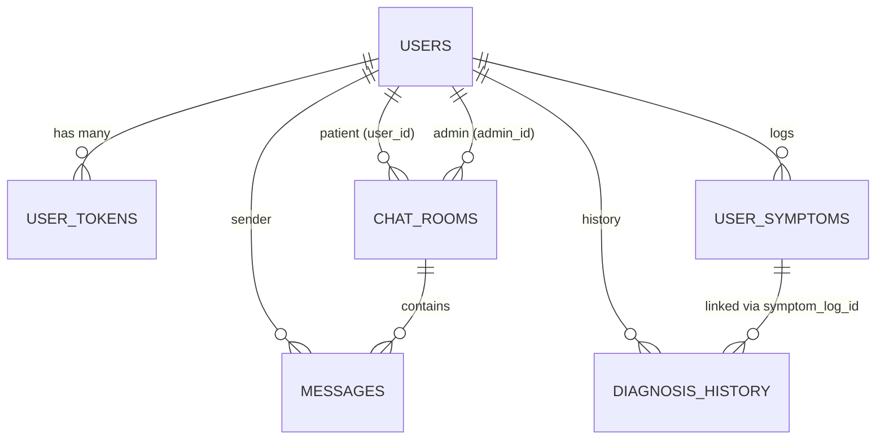

# iCoass Backend - Project Overview

## 📋 Executive Summary

**iCoass Backend** adalah backend service untuk aplikasi **iCoass (Koas Interactive Consultation & Assessment System)** - platform konsultasi medis berbasis AI untuk mahasiswa dokter koas. Sistem ini menyediakan API RESTful, WebSocket real-time chat, dan integrasi dengan microservice Python untuk diagnosis Naive Bayes.

---

## 🏗️ Architecture Overview

### **Clean Architecture + Separation of Concerns**

Proyek ini mengimplementasikan **Clean Architecture** dengan pemisahan layer yang ketat:

```
┌─────────────────────────────────────────────────────────────┐
│                     PRESENTATION LAYER                       │
│  Controllers │ Middlewares │ Routes │ Socket Handlers       │
└──────────────────────────┬──────────────────────────────────┘
                           │ Dependency Inversion
┌──────────────────────────▼──────────────────────────────────┐
│                      APPLICATION LAYER                       │
│                    Use Cases (Business Logic)                │
└──────────────────────────┬──────────────────────────────────┘
                           │ Dependency Inversion
┌──────────────────────────▼──────────────────────────────────┐
│                    INFRASTRUCTURE LAYER                      │
│  Repositories │ Database │ Models │ External Services       │
└──────────────────────────┬──────────────────────────────────┘
                           │
┌──────────────────────────▼──────────────────────────────────┐
│                       DOMAIN LAYER                           │
│              Entities / Domain Models (Empty - Implicit)     │
└─────────────────────────────────────────────────────────────┘
```

---

## 📁 Directory Structure Detail

```
backend/
├── app.js                          # Entry point, DI Container, Route registration
├── package.json                    # Dependencies & scripts
├── swagger.js                      # Swagger/OpenAPI generator
├── swagger-output.json             # Generated API documentation
├── Dockerfile                      # Container configuration
├── docker-compose.yml              # Multi-service orchestration (commented)
├── .env                            # Environment variables
│
├── src/
│   ├── application/                # 🎯 APPLICATION LAYER (Business Logic)
│   │   └── usecase/
│   │       ├── UserUseCase.js      # Auth, Profile, Token Management
│   │       ├── ArticleUseCase.js   # Article CRUD + file cleanup
│   │       ├── DiagnosisUseCase.js # AI Diagnosis orchestration
│   │       ├── HospitalUsecase.js  # Hospital search & CRUD
│   │       └── ChatUseCase.js      # Queue, Message, Room management
│   │
│   ├── domain/                     # 🏛️ DOMAIN LAYER (Empty - implicit in models)
│   │
│   ├── infrastructure/             # 🔧 INFRASTRUCTURE LAYER
│   │   ├── database/
│   │   │   ├── sequelize.js        # DB Connection (Singleton)
│   │   │   └── seeder.js           # Admin seeding script
│   │   ├── models/                 # Sequelize Models (Auto-generated)
│   │   │   ├── init-models.js      # Model associations
│   │   │   ├── users.js
│   │   │   ├── user_tokens.js
│   │   │   ├── articles.js
│   │   │   ├── hospitals.js
│   │   │   ├── chat_rooms.js
│   │   │   ├── messages.js
│   │   │   ├── user_symptoms.js
│   │   │   └── diagnosis_history.js
│   │   ├── repositories/           # Data Access Layer
│   │   │   ├── UsersRepository.js
│   │   │   ├── UserTokenRepository.js
│   │   │   ├── ArticlesRepository.js
│   │   │   ├── DiagnosisRepository.js
│   │   │   ├── ChatRepository.js
│   │   │   └── HospitalRepository.js
│   │   ├── socket/                 # Real-time Communication
│   │   │   ├── SocketServer.js     # Standalone socket init (legacy)
│   │   │   └── ChatHandler.js      # Event handlers for chat
│   │   └── utils/
│   │       └── RouteScanner.js     # Debug utility: print registered routes
│   │
│   └── presentation/               # 🌐 PRESENTATION LAYER
│       ├── controllers/            # HTTP Request Handlers
│       │   ├── UserController.js
│       │   ├── ArticleController.js
│       │   ├── DiagnosisController.js
│       │   ├── HospitalController.js
│       │   └── ChatController.js
│       └── middlewares/            # Cross-cutting Concerns
│           ├── AuthMiddleware.js   # JWT Verification
│           ├── AdminMiddleware.js  # Role-based Authorization
│           ├── SelfMiddleware.js   # Ownership Validation
│           ├── UserValidator.js    # Input Validation (express-validator)
│           ├── ArticleValidator.js
│           ├── HospitalValidator.js
│           ├── UploadMiddleware.js # Multer file upload
│           └── LogMiddleware.js    # Request Logging
│
└── public/
    └── uploads/                    # Static file storage (images)
```

---

## 🔑 Core Features & Modules

### 1. **Authentication & Authorization** (`UserUseCase` + `AuthMiddleware`)
| Feature | Implementation |
|---------|----------------|
| **Register/Login** | Username/Email + Password (bcrypt) |
| **JWT Access Token** | 15 min expiry, signed with `JWT_SECRET` |
| **Refresh Token** | 7 days expiry, stored in DB (`user_tokens`), `REFRESH_TOKEN_SECRET` |
| **Strict Single Device** | Login revokes all previous tokens + GC cleanup |
| **Token Rotation** | `/api/refresh-token` issues new access token |
| **Logout** | Revokes refresh token in DB |
| **Role-Based Access** | `patient` \| `admin` (middleware: `AdminMiddleware`) |
| **Ownership Check** | `SelfMiddleware` ensures users only access own data |

### 2. **Article Management** (`ArticleUseCase` + `ArticleController`)
- CRUD operations (Admin only for write)
- Image upload via Multer (`uploadArticleImage`)
- Auto-delete physical file on article deletion
- Public read access (authenticated)

### 3. **Hospital Directory** (`HospitalUsecase` + `HospitalController`)
- CRUD operations (Admin only for write)
- **Geospatial Search**: Find nearest hospitals using Haversine formula
- Query params: `latitude`, `longitude`, `radius` (km), `page`, `limit`
- Image upload via Multer (`uploadHospitalImage`)

### 4. **AI Diagnosis** (`DiagnosisUseCase` + `DiagnosisController`)
- **Orchestrates** call to Python Microservice (`PYTHON_SERVICE_URL/predict`)
- Input: Array of symptom codes (e.g., `["AP002", "AN003"]`)
- Output: Main diagnosis, confidence score, candidate diagnoses
- **Persistence**: 
  - `user_symptoms` table (input log)
  - `diagnosis_history` table (result + JSON details)
- Paginated history retrieval

### 5. **Real-time Chat** (`ChatUseCase` + `ChatHandler` + Socket.io)
| Event | Direction | Description |
|-------|-----------|-------------|
| `request_chat` | Client → Server | Patient creates queue |
| `new_queue_available` | Server → All Admins | Broadcast new pending room |
| `accept_chat` | Admin → Server | Admin claims patient |
| `chat_activated` | Server → Room | Notify patient chat started |
| `send_message` | Client → Server | Save & broadcast message |
| `receive_message` | Server → Room | Real-time message delivery |
| `join_existing_room` | Client → Server | Reconnect to room |
| `close_chat` | Admin → Server | Close session, notify all |
| `queue_updated` | Server → Admins | Refresh admin queue list |

**Room States**: `pending` → `active` → `closed`

### 6. **Health Check** (`/health`)
Monitors:
- Main service status
- Database connectivity (Sequelize authenticate)
- Python Microservice availability

---

## 🗄️ Database Schema (MySQL + Sequelize)

### Tables & Relationships



| Table | Key Columns | Purpose |
|-------|-------------|---------|
| `users` | id, username, email, password, full_name, phone, birth_date, gender, address, role | Core user entity |
| `user_tokens` | id, user_id, refresh_token, expires_at, is_revoked | Refresh token storage + revocation |
| `articles` | id, title, content, image_url | Health articles |
| `hospitals` | id, name, address, latitude, longitude, image_url, phone | Hospital directory |
| `chat_rooms` | id, user_id, admin_id, status (pending/active/closed) | Chat session |
| `messages` | id, room_id, sender_id, message_text | Chat messages |
| `user_symptoms` | id, user_id, selected_symptoms (JSON) | Diagnosis input log |
| `diagnosis_history` | id, user_id, symptom_log_id, main_diagnosis, confidence_score, diagnosis_details (JSON) | Diagnosis result |

---

## 🔄 Separation of Concerns Implementation

### Layer Responsibilities

| Layer | Responsibility | Files | Dependency Direction |
|-------|---------------|-------|---------------------|
| **Presentation** | HTTP handling, validation, serialization, middleware | Controllers, Middlewares, Socket Handlers | → Application |
| **Application** | Business logic, orchestration, transactions, rules | UseCases | → Infrastructure (via interfaces) |
| **Infrastructure** | Data persistence, external services, framework glue | Repositories, Models, Sequelize, Socket.io | ← Application (implements interfaces) |
| **Domain** | Enterprise business rules, entities | (Implicit in Sequelize models) | Innermost, no deps |

### Dependency Rule Compliance

```javascript
// ✅ CORRECT: app.js (Composition Root) injects Infrastructure into Application
const userRepo = new UserRepository();           // Infrastructure
const userTokenRepo = new UserTokenRepository(); // Infrastructure
const userUseCase = new UserUseCase(userRepo, userTokenRepo); // Application
const userController = new UserController(userUseCase);       // Presentation

// ✅ CORRECT: UseCase depends on Repository INTERFACE (duck-typed)
class UserUseCase {
    constructor(usersRepository, userTokenRepository) { // Interfaces
        this.usersRepository = usersRepository;
        this.userTokenRepository = userTokenRepository;
    }
}

// ✅ CORRECT: Repository implements data access
class UsersRepository {
    async findById(id) { return await models.users.findByPk(id); }
}

// ❌ WRONG: UseCase importing Sequelize directly
// import { models } from '../infrastructure/models/init-models'; // VIOLATION
```

### Cross-Cutting Concerns (Middlewares)

| Middleware | Concern | Applied At |
|------------|---------|------------|
| `LogMiddleware` | Request logging | Global (`app.use`) |
| `AuthMiddleware` | Authentication (JWT) | Route-level |
| `AdminMiddleware` | Authorization (role=admin) | Route-level |
| `SelfMiddleware` | Authorization (ownership) | Route-level |
| `UserValidator` | Input validation | Route-level |
| `UploadMiddleware` | File handling | Route-level |

---

## 🧩 Clean Architecture Principles Applied

### 1. **Dependency Inversion Principle (DIP)**
- UseCases define **what they need** (repository interfaces)
- Infrastructure **implements** those needs
- `app.js` (Composition Root) wires them together

### 2. **Single Responsibility Principle (SRP)**
- Each UseCase handles **one domain** (User, Article, Diagnosis, etc.)
- Each Repository handles **one entity**
- Each Controller handles **one resource**
- Each Middleware handles **one concern**

### 3. **Open/Closed Principle (OCP)**
- Add new features by **extending** (new UseCase/Repository/Controller)
- Minimal modification to existing code
- Middlewares composable for new auth/validation rules

### 4. **Interface Segregation**
- Repositories expose **only needed methods**
- `UserTokenRepository` has token-specific methods (`revokeAllUserTokens`, `deleteExpiredAndRevokedTokens`)
- No "God Repository" with unused methods

### 5. **Domain-Driven Design (DDD) Touches**
- **Aggregates**: `User` with `UserTokens` (cascade delete in UseCase)
- **Value Objects**: Symptom codes array, Diagnosis details JSON
- **Domain Events**: Implicit via Socket.io (`new_queue_available`, `chat_activated`)

---

## 🔐 Security Implementation

| Aspect | Implementation |
|--------|----------------|
| **Password Hashing** | bcryptjs, configurable rounds (`BCRYPT_SALT_ROUNDS`) |
| **JWT** | jsonwebtoken, separate secrets for access/refresh |
| **Token Storage** | Refresh tokens in DB with revocation flag |
| **Single Device** | Login revokes all existing tokens + GC cleanup |
| **Token Expiry** | Access: 15min, Refresh: 7days |
| **CORS** | Configured per environment (`origin: "*"` dev) |
| **Input Validation** | express-validator on all mutating endpoints |
| **File Upload** | Multer with type/size restrictions |
| **SQL Injection** | Sequelize ORM (parameterized queries) |

---

## 📡 API Endpoints Summary

### Public Auth
| Method | Endpoint | Description |
|--------|----------|-------------|
| POST | `/api/register` | Register new user |
| POST | `/api/login` | Login (username + password) |
| POST | `/api/refresh-token` | Get new access token |
| POST | `/api/logout` | Revoke refresh token |

### User (Authenticated)
| Method | Endpoint | Auth | Description |
|--------|----------|------|-------------|
| GET | `/api/users/:id` | Self | Get own profile |
| PUT | `/api/users/:id` | Self | Update profile |
| GET | `/api/users` | Admin | List all users |
| DELETE | `/api/admin/users/:id` | Admin | Delete user |

### Articles
| Method | Endpoint | Auth | Description |
|--------|----------|------|-------------|
| GET | `/api/articles` | User | List articles |
| GET | `/api/articles/:id` | User | Get article |
| POST | `/api/articles` | Admin | Create + upload image |
| PUT | `/api/articles/:id` | Admin | Update |
| DELETE | `/api/articles/:id` | Admin | Delete + cleanup file |

### Hospitals
| Method | Endpoint | Auth | Description |
|--------|----------|------|-------------|
| GET | `/api/hospitals` | User | List (with geo search) |
| GET | `/api/hospitals/:id` | User | Get hospital |
| POST | `/api/hospitals` | Admin | Create + upload image |
| PUT | `/api/hospitals/:id` | Admin | Update |
| DELETE | `/api/hospitals/:id` | Admin | Delete |

### Diagnosis
| Method | Endpoint | Auth | Description |
|--------|----------|------|-------------|
| POST | `/api/diagnosis` | User | Run AI diagnosis |
| GET | `/api/diagnosis/history` | User | Paginated history |

### Chat
| Method | Endpoint | Auth | Description |
|--------|----------|------|-------------|
| GET | `/api/chat/rooms` | User | My chat rooms |
| GET | `/api/chat/messages/:roomId` | User | Room messages |
| GET | `/api/chat/queues` | Admin | Pending queues |
| POST | `/api/chat/close/:roomId` | Admin | Close chat |

---

## 🐳 Deployment & DevOps

### Docker (docker-compose.yml - Commented Template)
```yaml
services:
  db:
    image: mysql:8.0
    environment:
      MYSQL_DATABASE: db_icoass
      MYSQL_ROOT_PASSWORD: "123"
    ports: ["3306:3306"]
    volumes: [icoass_db_data:/var/lib/mysql]

  backend:
    build: .
    ports: ["3003:3003"]
    environment:
      - DB_HOST=db
      - PYTHON_SERVICE_URL=http://host.docker.internal:8080
    depends_on: [db]
    env_file: .env
```

### Environment Variables (.env)
```env
PORT=3003
DB_HOST=localhost
DB_USER=root
DB_PASSWORD=123
DB_NAME=db_icoass
JWT_SECRET=iCoass_2026
REFRESH_TOKEN_SECRET=iCoas_2026
BCRYPT_SALT_ROUNDS=12
PYTHON_SERVICE_URL=http://localhost:8080
NODE_ENV=development
```

### Scripts
```json
{
  "start": "node app.js",
  "dev": "nodemon app.js",
  "swagger": "node swagger.js"
}
```

---

## 🔧 Key Technical Decisions

### 1. **Two-Level Cascade Delete for User Tokens**
- **Application Level** (`UserUseCase.deleteUser`): Explicit `deleteAllUserTokens()` before user deletion
- **Database Level** (Manual SQL): `ON DELETE CASCADE` FK constraint on `user_tokens.user_id`
- **Rationale**: Defense in depth - works even if DB constraint missing or bypassed

### 2. **Strict Single Device Session**
- Login: `revokeAllUserTokens()` → `deleteExpiredAndRevokedTokens()` (GC) → Create new token
- Prevents token accumulation, enforces single active session

### 3. **Sequelize Models Auto-Generated**
- `sequelize-auto` used for model generation (`devDependencies`)
- Models in `infrastructure/models/` - **do not edit manually**
- Associations defined in `init-models.js`

### 4. **Socket.io Integrated in Main Process**
- Not separate service - shares Express HTTP server
- `ChatHandler` receives `chatUseCase` via DI (testable)
- Events: `request_chat`, `accept_chat`, `send_message`, `close_chat`

### 5. **Python Microservice Integration**
- Diagnosis offloaded to separate Python service (Naive Bayes)
- Communication via HTTP (`axios.post`)
- Async orchestration in `DiagnosisUseCase`

---

## 📈 Scalability Considerations

| Area | Current | Future Improvement |
|------|---------|-------------------|
| **Database** | Single MySQL | Read replicas, connection pooling |
| **Socket.io** | Single process | Redis adapter for multi-node |
| **File Storage** | Local `public/uploads` | S3/Cloud Storage + CDN |
| **Caching** | None | Redis for hospital search, articles |
| **Rate Limiting** | None | `express-rate-limit` middleware |
| **Monitoring** | Basic `/health` | Prometheus/Grafana, structured logging |

---

## 🧪 Testing Strategy (Recommended)

```
tests/
├── unit/
│   ├── usecases/
│   │   ├── UserUseCase.test.js      # Mock repositories
│   │   ├── DiagnosisUseCase.test.js # Mock axios + repository
│   │   └── ChatUseCase.test.js
│   └── repositories/
│       └── UserTokenRepository.test.js # Test cascade delete
├── integration/
│   ├── auth.flow.test.js            # Register → Login → Refresh → Logout
│   ├── chat.flow.test.js            # Socket.io integration
│   └── diagnosis.flow.test.js       # Python service mock
└── e2e/
    └── api.test.js                  # Full HTTP request/response
```

---

## 📝 Changelog / Recent Changes

| Date | Change | Files |
|------|--------|-------|
| 2026-08-10 | Added `deleteAllUserTokens` + cascade delete in `deleteUser` | `UserTokenRepository.js`, `UserUseCase.js` |
| 2026-08-10 | Implemented Strict Single Device with GC | `UserUseCase.js` (login) |
| 2026-08-10 | Socket.io ChatHandler with queue management | `ChatHandler.js` |
| 2026-08-10 | Geospatial hospital search (Haversine) | `HospitalRepository.js`, `HospitalUsecase.js` |

---

## 🎯 Architecture Decision Records (ADR)

### ADR-001: Clean Architecture over Layered Architecture
**Decision**: Adopt Clean Architecture with explicit layer separation
**Rationale**: Testability, maintainability, framework independence
**Consequence**: More boilerplate (DI in app.js), but clear boundaries

### ADR-002: Sequelize over Raw SQL / Prisma
**Decision**: Use Sequelize ORM with auto-generated models
**Rationale**: Existing MySQL schema, team familiarity, migration support
**Consequence**: Model changes require regeneration

### ADR-003: Socket.io in Main Process
**Decision**: Embed Socket.io in Express server (not separate service)
**Rationale**: Simpler deployment, shared DI container, low chat volume
**Consequence**: Horizontal scaling requires Redis adapter

### ADR-004: Python Microservice for ML
**Decision**: Offload Naive Bayes to separate Python service
**Rationale**: Python ecosystem for ML, separation of concerns, independent scaling
**Consequence**: Network latency, service discovery needed

---

## 📚 References

- [Clean Architecture - Robert C. Martin](https://blog.cleancoder.com/uncle-bob/2012/08/13/the-clean-architecture.html)
- [Sequelize Documentation](https://sequelize.org/)
- [Socket.io Documentation](https://socket.io/docs/v4/)
- [Express.js Best Practices](https://expressjs.com/en/advanced/best-practice-performance.html)

---

*Document generated: 2026-08-10*
*Project: iCoass Backend v1.0.0*